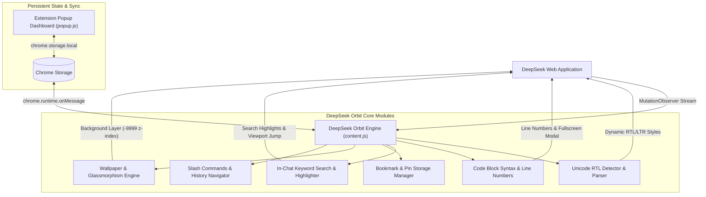

# 🌌 DeepSeek Orbit — Smart Workspace & RTL Flow (v1.5.0)

<p align="center">
  
</p>

<p align="center">
  <a href="https://github.com/EhsanShahbazii"></a>
  <a href="https://github.com/EhsanShahbazii/DeepSeek-Orbit/releases"></a>
  
  <a href="LICENSE"></a>
</p>

---

## 📖 Overview

**DeepSeek Orbit** is a modern open-source browser extension engineered exclusively for **[chat.deepseek.com](https://chat.deepseek.com)**. Designed and developed by **[Ehsan Shahbazi](https://github.com/EhsanShahbazii)**, it elevates DeepSeek AI with seamless bidirectional Right-to-Left (RTL) Persian & Arabic typography, developer-grade code enhancements, customizable glassmorphic wallpapers, in-chat keyword search, and prompt productivity workflows.

Crafted with DeepSeek's authentic **Royal Blue & Dark Obsidian** aesthetic, the extension integrates seamlessly without breaking native chat mechanics or streaming responses.

---

## ⚡ Key Highlights

- **🔄 Smart Bi-directional RTL Engine**: Evaluates text paragraph-by-paragraph to apply natural Right-to-Left alignment for Persian, Arabic, Hebrew, and Urdu text.
- **🛡️ Strict Code & Formula Isolation**: Keeps all code blocks (`pre`, `code`, `.md-code-block`) and mathematical equations (`LaTeX / KaTeX`) strictly Left-to-Right in monospace font.
- **🖼️ Custom Wallpaper Studio**: Upload personalized high-resolution wallpapers with real-time opacity (5%–60%) and background blur (0px–20px) sliders.
- **💻 Developer Code Suite**: Sticky line numbers on all code snippets, one-click word wrap toggle, and fullscreen syntax viewer modal with smooth GPU animations.
- **🔍 In-Chat Keyword Search**: Instant <kbd>Ctrl + F</kbd> search across active conversations with real-time match counters (`1 / 18`), keyword highlighting, and viewport auto-scrolling.
- **📌 Stable Message Bookmarks (Pins)**: Save vital assistant responses or prompts with native pushpin buttons and browse them in a slide-out drawer.
- **✍️ Slash Command Templates (`/`)**: Type `/` to open an instant prompt template menu (`/fix`, `/explain`, `/refactor`, `/summarize`, `/translate`, `/test`).
- **📜 Prompt History Cycling**: Navigate past prompts directly in the input box using <kbd>↑</kbd> and <kbd>↓</kbd> keyboard arrows.
- **🧠 Auto-Collapse DeepSeek-R1 Thoughts**: Keeps long "Thinking Process" accordions compact by default for clean and focused reading.
- **📤 Multi-Format Chat Exporter**: Download or copy conversation history in structured **Markdown**, **HTML / Print**, or **JSON**.

---

## 📸 Feature Walkthrough & Screenshots

### 1. 🔄 Bi-Directional RTL Alignment & Persian Typography
<p align="center">
  
</p>

- **Automatic Direction Switching**: Detects Persian and Arabic characters dynamically while keeping English text and variables Left-to-Right.
- **Font Preset Library**: Choose from **Vazirmatn**, **Sahel**, **Shabnam**, **Estedad**, **Samim**, **Dana**, **Tahoma**, or your own custom installed system fonts.
- **Auto-RTL Input Field**: Automatically switches prompt box direction as soon as you type Persian or Arabic.
- **Direction Hotkey**: <kbd>Ctrl + Shift + X</kbd> (or <kbd>Cmd + Shift + X</kbd> on macOS) to manually toggle input direction.

---

### 2. 🖼️ Custom Wallpaper Studio & Theming
<p align="center">
  
</p>

- **Hardware-Accelerated Layer**: Custom wallpaper renders underneath all chat content with zero performance overhead.
- **Live Sliders**: Instantly tweak wallpaper opacity (5%–60%) and background blur (0px–20px).
- **Centered Studio Modal**: Open the dedicated centered dialog to drag & drop or choose background wallpapers.
- **Glassmorphic Chat**: Message bubbles, thinking cards, and action bars turn transparent while preserving native DeepSeek sidebar colors.

---

### 3. 💻 Developer Code Enhancements & Fullscreen Viewer
<p align="center">
  
</p>

- **Unselectable Sticky Line Numbers**: Automatic line numbering on code snippets with synchronized scrollbars.
- **Word Wrap Toggle**: Switch between horizontal code scrolling and wrapped view with one click.
- **Fullscreen Syntax Viewer**: Expand code into a focused, distraction-free modal with vibrant syntax themes, line numbering, and copy buttons.
- **Smooth Close Animation**: GPU-accelerated enter and exit transitions (<kbd>Esc</kbd> to close).

---

### 4. 🔍 In-Chat Keyword Search & Message Pins
<p align="center">
  
</p>

- **Integrated Search Bar**: Press <kbd>Ctrl + F</kbd> or click Search on the floating toolbar to locate words across long conversations.
- **Quick Navigation**: Use <kbd>Enter</kbd> / <kbd>Shift + Enter</kbd> to jump between matches with viewport auto-scroll.
- **Pinned Messages Drawer**: Click the pushpin icon on any response to save it to your bookmarks drawer for instant 1-click jump.

---

### 5. ✍️ Slash Commands & Prompt History
<p align="center">
  
</p>

- **Instant Templates (`/`)**: Trigger structured coding, explanation, refactoring, and translation prompts in milliseconds.
- **History Cycling (<kbd>↑</kbd> / <kbd>↓</kbd>)**: Recall past prompts sequentially without re-typing.
- **Auto-Collapse R1 Thinking**: Keeps DeepSeek-R1 reasoning accordions neatly collapsed until you choose to expand them.

---

## 🏗️ System Architecture



---

## 📂 Modular Project Structure

```
deepseek-orbit/
├── manifest.json              # Chrome Extension Manifest (V3)
├── src/
│   ├── core/
│   │   ├── constants.js       # SVG icon library, font maps, slash templates & default state
│   │   ├── detector.js        # Unicode bi-directional RTL detection algorithm
│   │   └── storage.js         # Settings persistence & chrome.storage.local sync
│   ├── ui/
│   │   ├── code-enhancer.js   # Sticky line numbers, word wrap & fullscreen syntax modal
│   │   ├── search.js          # In-chat keyword search, match counter & auto-scroller
│   │   ├── pins.js            # Message bookmarking system & slide-out pinned drawer
│   │   ├── wallpaper.js       # Wallpaper compositor & centered Wallpaper Studio modal
│   │   ├── slash-commands.js  # Slash templates (/) & prompt history cycling (↑/↓)
│   │   └── toolbar.js         # Floating suite toolbar & multi-format export dropdown
│   ├── popup/
│   │   ├── popup.html         # Extension popup dashboard
│   │   ├── popup.css          # Glassmorphic dark theme styles
│   │   └── popup.js           # Real-time state persistence & cross-tab sync
│   ├── content.js             # Content script runtime coordinator
│   └── content.css            # DeepSeek native design system styles & animations
├── icons/
│   ├── icon16.png             # 16x16 HD Extension Icon
│   ├── icon48.png             # 48x48 HD Extension Icon
│   └── icon128.png            # 128x128 HD Extension Icon
├── assets/
│   ├── banner.png             # Official 16:9 glowing orbital hero banner
│   ├── icon.png               # Official 3D glassmorphic logo
│   └── screenshots/           # Extension interface preview screenshots
├── docs/
│   └── ARCHITECTURE.md        # Technical architecture reference
├── CHANGELOG.md               # Version release notes (v1.0.0 → v1.5.0)
├── CONTRIBUTING.md            # Open-source contribution guide
├── LICENSE                    # MIT License (Copyright 2026 Ehsan Shahbazi)
└── package.json               # Development metadata & bundling scripts
```

---

## ⌨️ Keyboard Shortcuts

| Shortcut | Action | Description |
| :--- | :--- | :--- |
| <kbd>Ctrl</kbd> + <kbd>Shift</kbd> + <kbd>X</kbd> / <kbd>Cmd</kbd> + <kbd>Shift</kbd> + <kbd>X</kbd> | **Toggle Direction** | Instantly switches the prompt input box between RTL and LTR |
| <kbd>Ctrl</kbd> + <kbd>F</kbd> | **In-Chat Search** | Opens the keyword search bar with real-time match highlighting |
| <kbd>Enter</kbd> / <kbd>Shift</kbd> + <kbd>Enter</kbd> | **Next / Prev Match** | Jumps to the next or previous keyword match |
| <kbd>↑</kbd> / <kbd>↓</kbd> | **Prompt History** | Cycles through previously sent prompts in the input field |
| <kbd>/</kbd> | **Slash Templates** | Opens the instant prompt templates dropdown |
| <kbd>Esc</kbd> | **Close Overlays** | Closes search bar, fullscreen code modal, or pinned messages drawer |

---

## 🚀 Installation Guide

### Chrome / Brave / Edge / Chromium

1. Clone or download this repository:
   ```bash
   git clone https://github.com/EhsanShahbazii/DeepSeek-Orbit.git
   cd DeepSeek-Orbit
   ```
2. Open your browser and navigate to **`chrome://extensions/`**.
3. Enable **Developer mode** in the top-right corner.
4. Click **Load unpacked** in the top-left corner.
5. Select the `DeepSeek-Orbit` root directory.
6. Open **[chat.deepseek.com](https://chat.deepseek.com)** and enjoy a supercharged DeepSeek experience!

---

## 🛡️ Privacy & Security

> [!NOTE]
> **DeepSeek Orbit** is 100% client-side and open-source.
>
> - **Zero Analytics / Tracking**: No tracking pixels, remote telemetries, or data collection.
> - **Local Storage Only**: All settings, custom wallpapers, and pins stay strictly inside your browser's `chrome.storage.local`.
> - **No Remote Dependencies**: Loads zero external scripts at runtime.

---

## 👨‍💻 Author & Credits

- **Architect & Lead Developer**: **Ehsan Shahbazi**
- **GitHub**: [@EhsanShahbazii](https://github.com/EhsanShahbazii)
- **Email**: [ehsan.shahbazipc@gmail.com](mailto:ehsan.shahbazipc@gmail.com)

---

## 🤝 Contributing

Contributions are warmly welcomed! Please read [CONTRIBUTING.md](CONTRIBUTING.md) for details on our code of conduct and pull request process.

---

## 📄 License

This project is licensed under the **MIT License** — see the [LICENSE](LICENSE) file for details.

Copyright (c) 2026 **Ehsan Shahbazi**.
