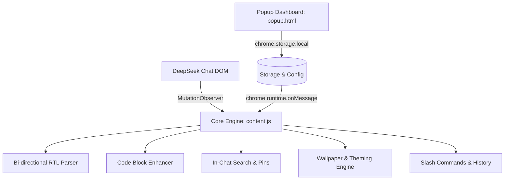

<div align="center">

  

  # 🌌 DeepSeek Orbit
  ### *Smart Workspace & RTL Flow for DeepSeek*

  <p align="center">
    <strong>Elevating DeepSeek AI with intelligent Persian/Arabic RTL alignment, custom wallpapers, developer tools, prompt productivity, and lightning-fast chat navigation.</strong>
  </p>

  <p align="center">
    <a href="https://github.com/gapcode/deepseek-orbit/releases"></a>
    <a href="LICENSE"></a>
    <a href="https://chat.deepseek.com"></a>
    <a href="https://developer.chrome.com/docs/extensions/mv3/intro/"></a>
    <a href="CONTRIBUTING.md"></a>
  </p>

</div>

---

## ⚡ Overview

**DeepSeek Orbit** is a premium, open-source browser extension meticulously crafted for **[chat.deepseek.com](https://chat.deepseek.com)**. It seamlessly integrates into DeepSeek's native design system to deliver an effortless bidirectional reading and typing experience, developer-grade code tools, personalized custom wallpapers, and advanced workspace management.

Whether you're writing in Persian/Arabic, debugging code, searching long conversations, or customizing your workspace, DeepSeek Orbit provides the missing power tools for DeepSeek AI.

---

## ✨ Features at a Glance

| Feature | Description | Status |
| :--- | :--- | :---: |
| 🔄 **Smart Bi-directional RTL** | Auto-detects Persian/Arabic paragraphs; keeps code & math strictly LTR | ✅ Active |
| 🖼️ **Custom Wallpaper Studio** | Upload custom backgrounds with real-time opacity & blur sliders | ✅ Active |
| 💻 **Developer Code Suite** | Sticky line numbers, word wrap toggling, and fullscreen syntax viewer | ✅ Active |
| 🔍 **In-Chat Keyword Search** | Instant <kbd>Ctrl+F</kbd> search with real-time highlight & match jumping | ✅ Active |
| 📌 **Message Bookmarks (Pins)** | One-click pin assistant answers and manage them from a slide-out drawer | ✅ Active |
| ✍️ **Slash Commands (`/`)** | Quick prompt templates (`/fix`, `/explain`, `/refactor`, `/summarize`, etc.) | ✅ Active |
| 📜 **Prompt History Cycling** | Cycle through previously sent prompts using <kbd>↑</kbd> and <kbd>↓</kbd> arrows | ✅ Active |
| 🧠 **Auto-Collapse Thoughts** | Keeps long DeepSeek-R1 "Thinking Process" blocks compact by default | ✅ Active |
| 📤 **Multi-Format Export** | Download or copy chat as Markdown, HTML/Print, or structured JSON | ✅ Active |
| 🔤 **Persian Typography** | Beautiful fonts (Vazirmatn, Sahel, Shabnam, Estedad, Samim, Dana, Tahoma) | ✅ Active |

---

## 🚀 Key Feature Showcase

### 1. 🔄 Smart Bidirectional RTL Alignment
- **Intelligent Unicode Detection:** Evaluates text paragraph-by-paragraph to set proper Right-to-Left alignment for Persian, Arabic, Urdu, and Hebrew.
- **Strict Code & Formula Isolation:** Code blocks (`pre`, `code`), markdown blocks (`.md-code-block`), and LaTeX formulas (`KaTeX`) remain strictly Left-to-Right with monospace styling.
- **Auto-RTL Input Field:** Automatically adjusts input direction dynamically as you type Persian or English.
- **Shortcut Toggle:** Press <kbd>Ctrl + Shift + X</kbd> (or <kbd>Cmd + Shift + X</kbd> on macOS) to instantly force-toggle text direction.

### 2. 🖼️ Custom Wallpaper Studio & Theming
- **Personalized Backdrops:** Upload any high-resolution wallpaper (PNG, JPG, WebP, SVG) to replace the default flat background.
- **Real-Time Sliders:** Adjust wallpaper opacity (5%–60%) and background blur (0px–20px) with instant visual feedback.
- **Pure Glassmorphism:** Chat bubbles, thinking accordions, and message action bars adopt smooth transparency while preserving native DeepSeek sidebar colors.
- **Zero Distractions:** Wallpaper renders in a dedicated hardware-accelerated layer behind all UI elements.

### 3. 💻 Developer Code Enhancements
- **Sticky Line Numbers:** Clean, non-selectable line numbers rendered across all code blocks.
- **Word Wrap:** Native DeepSeek-styled header button to toggle between horizontal code scrolling and wrapped lines.
- **Fullscreen Syntax Viewer:** Click **Expand** to open any code block in a distraction-free, syntax-highlighted modal with line numbering, word wrap, and one-click copying.

### 4. ✍️ Prompting Productivity & Slash Commands
- **Slash Commands (`/`):** Type `/` in an empty prompt field to trigger instant templates:
  - `/fix` — Analyze bugs, identify root causes, and provide corrected code.
  - `/explain` — Clear step-by-step breakdown and conceptual explanation.
  - `/refactor` — Improve architecture, readability, and performance.
  - `/summarize` — Generate concise summary points.
  - `/translate` — Translate into fluent Persian while preserving technical code terms.
  - `/test` — Write comprehensive unit tests with edge cases.
- **Prompt History Navigation:** Press <kbd>↑</kbd> in an empty input field to navigate previously sent prompts and <kbd>↓</kbd> to return to your current draft.

### 5. 🔍 In-Chat Keyword Search & Bookmarking
- **Integrated Search Bar:** Press <kbd>Ctrl + F</kbd> or click **Search** on the floating toolbar to search across active chats with real-time match counters (`1 / 18`) and viewport auto-scrolling.
- **Bookmark & Pin Messages:** Click the pushpin icon on any message to save it to your Pinned Messages drawer for quick 1-click retrieval.

---

## ⌨️ Keyboard Shortcuts Reference

| Shortcut | Action | Scope |
| :--- | :--- | :--- |
| <kbd>Ctrl</kbd> + <kbd>Shift</kbd> + <kbd>X</kbd> / <kbd>Cmd</kbd> + <kbd>Shift</kbd> + <kbd>X</kbd> | Toggle Input Field Text Direction (RTL / LTR) | Input Box |
| <kbd>Ctrl</kbd> + <kbd>F</kbd> | Open In-Chat Keyword Search Bar | Global |
| <kbd>Enter</kbd> / <kbd>Shift</kbd> + <kbd>Enter</kbd> | Jump to Next / Previous Search Match | Search Active |
| <kbd>↑</kbd> / <kbd>↓</kbd> | Cycle through Previous / Next Sent Prompts | Empty Input Box |
| <kbd>/</kbd> | Open Slash Command Templates Menu | Empty Input Box |
| <kbd>Esc</kbd> | Close Search Bar, Fullscreen Code, or Drawers | Global |

---

## 🛠️ Installation & Setup

### Method 1: Load as Developer Extension (Recommended)

1. **Clone or Download** this repository:
   ```bash
   git clone https://github.com/gapcode/deepseek-orbit.git
   cd deepseek-orbit
   ```
2. Open Google Chrome / Chromium (Brave, Edge, Arc, Opera).
3. Navigate to **`chrome://extensions`**.
4. Enable **Developer mode** using the toggle in the top-right corner.
5. Click **Load unpacked** in the top-left corner.
6. Select the `deepseek-orbit` directory.
7. Navigate to **[chat.deepseek.com](https://chat.deepseek.com)** and enjoy!

---

## 🏗️ Project Architecture



---

## 🗂️ Repository Structure

```
deepseek-orbit/
├── manifest.json         # Chrome Extension Manifest V3 configuration
├── content.js            # Main content script (RTL engine, UI suite, modals)
├── content.css           # DeepSeek native design system styles & animations
├── popup.html            # Extension popup dashboard & settings UI
├── popup.css             # Popup styling & Dark theme controls
├── popup.js              # Settings persistence & runtime cross-tab broadcasting
├── icons/                # Extension icons (16px, 48px, 128px)
├── assets/               # Banner, logos, and documentation assets
├── CHANGELOG.md          # Version release history
├── CONTRIBUTING.md       # Open-source contribution guidelines
├── LICENSE               # MIT License
└── package.json          # Development metadata & bundling scripts
```

---

## 🤝 Contributing

Contributions make the open-source community an amazing place to learn, inspire, and create. Any contributions you make are **greatly appreciated**.

1. Fork the Project.
2. Create your Feature Branch (`git checkout -b feat/AmazingFeature`).
3. Commit your Changes (`git commit -m 'feat: Add some AmazingFeature'`).
4. Push to the Branch (`git push origin feat/AmazingFeature`).
5. Open a Pull Request.

Please read [CONTRIBUTING.md](CONTRIBUTING.md) for details on our code of conduct and development standards.

---

## 👤 Author

**Ehsan Ghaffar**
* GitHub: [@gapcode](https://github.com/gapcode)

---

## 📄 License

Distributed under the **MIT License**. See [`LICENSE`](LICENSE) for more information.

<div align="center">
  <sub>Built with ❤️ for the DeepSeek AI community worldwide.</sub>
</div>
