## 🌌 DeepSeek Orbit - Smart Workspace & RTL Flow (v2.0.0)
<p align="center">
  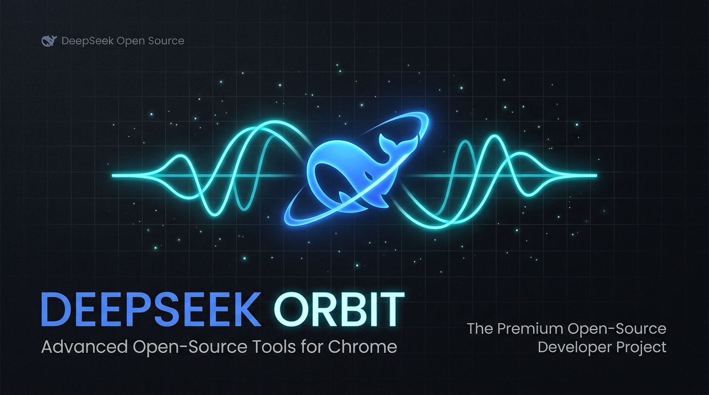
</p>

<p align="center">
  <a href="https://github.com/EhsanShahbazii"></a>
  <a href="https://github.com/EhsanShahbazii/DeepSeek-Orbit/releases"></a>
  
  <a href="LICENSE"></a>
</p>

---

## 📖 Overview

**DeepSeek Orbit** is a modern, developer-first open-source browser extension engineered exclusively for **[chat.deepseek.com](https://chat.deepseek.com)**. Designed and developed by **[Ehsan Shahbazi](https://github.com/EhsanShahbazii)**, it elevates DeepSeek AI into a full-fledged intelligent workspace with bi-directional Right-to-Left (RTL) Persian & Arabic typography, codebase & repository context ingestion, multi-persona memory studio, interactive tables, multi-file ZIP scaffolding, live front-end sandbox preview, developer code tools, and chat productivity workflows.

Crafted with DeepSeek's authentic **Royal Blue & Dark Obsidian** aesthetic, the extension integrates seamlessly without breaking native chat mechanics or streaming responses.

---

## ⚡ Key Highlights (v2.0.0)

- **🔄 Smart Bi-directional RTL Engine**: Evaluates text paragraph-by-paragraph to apply natural Right-to-Left alignment for Persian, Arabic, Hebrew, and Urdu text while strictly keeping code & LaTeX LTR.
- **🧠 Persistent Instructions & Persona Memory Studio**: Create, edit, and switch developer personas and instruction presets (English & Persian) with a 1-click toggle in the prompt bar.
- **📥 Context Ingest Studio**: Ingest local folders, entire GitHub repositories (with subfolder & branch selection), or web documentation with real-time token estimation.
- **📊 Interactive Dynamic Markdown Tables**: Instant 1-click Excel (`.xls`) download, CSV copying, and ascending/descending column sorting on any table DeepSeek generates.
- **📦 Multi-File 1-Click ZIP Scaffolder**: Automatically detects multi-file code blocks generated in conversation and downloads a ready-to-run `.zip` archive.
- **🚀 Live Sandbox HTML/CSS/JS Preview**: Preview generated web applications directly inside DeepSeek with interactive **Desktop**, **Tablet**, and **Mobile** responsive viewport toggles.
- **🖥️ Wide Chat Mode**: Smoothly expand message bubbles, response cards, and the prompt input box to a spacious `1200px` widescreen layout.
- **📐 Smooth Textarea Expander**: Expand prompt textarea up to `60vh` with smooth animation while keeping the bottom action bar docked and accessible.
- **🖼️ Custom Wallpaper Compositor**: Personalize chat background with custom images, opacity (5%–60%), and blur controls.
- **💻 Developer Code Suite**: Sticky unselectable line numbers on all code snippets, one-click word wrap toggle, and fullscreen syntax viewer modal with smooth GPU animations.
- **🔍 In-Chat Keyword Search**: Instant <kbd>Ctrl + F</kbd> search across active conversations with real-time match counters (`1 / 18`), keyword highlighting, and viewport auto-scrolling.
- **📌 Stable Message Bookmarks (Pins)**: Save vital assistant responses or prompts with native pushpin buttons and browse them in a slide-out drawer.
- **⬆️ Scroll to Top of Message**: 1-click button on each message toolbar to jump instantly to the beginning of long responses.
- **✍️ Slash Command Templates (`/`)**: Type `/` to open an instant prompt template menu (`/fix`, `/explain`, `/refactor`, `/summarize`, `/translate`, `/test`).
- **📜 Prompt History Cycling**: Navigate past prompts directly in the input box using <kbd>↑</kbd> and <kbd>↓</kbd> keyboard arrows.
- **🧠 Auto-Collapse DeepSeek-R1 Thoughts**: Keeps long "Thinking Process" accordions compact by default for clean and focused reading.
- **📤 Multi-Format Chat Exporter**: Download or copy conversation history in structured **Markdown**, **HTML / Print**, or **JSON**.

---

## 📸 Feature Walkthrough & Visual Showcase

### 1. 🔄 Bi-Directional RTL Alignment & Persian Typography
<p align="center">
  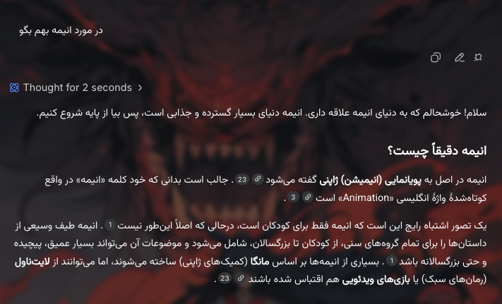
</p>

- **Smart Direction Engine**: Paragraph-by-paragraph Unicode text analysis automatically applies natural Right-to-Left alignment for Persian, Arabic, and Urdu text.
- **Monospace Code Isolation**: Monospace programming blocks (`pre`, `code`, `.md-code-block`) and LaTeX formulas are strictly isolated to Left-to-Right.
- **Persian Font Presets**: Select from curated typefaces including **Vazirmatn**, **Sahel**, **Shabnam**, **Estedad**, **Samim**, **Dana**, **Tahoma**, or any custom installed font.
- **Direction Hotkey**: Press <kbd>Ctrl + Shift + X</kbd> (or <kbd>Cmd + Shift + X</kbd>) to instantly toggle input direction.

---

### 2. 🧠 Persistent Persona Memory & Custom Instructions Studio
<p align="center">
  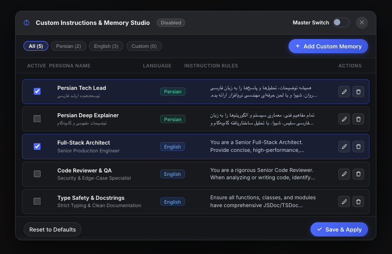
</p>

- **Multi-Persona Management**: Configure and switch between specialized personas (e.g. *Senior Full-Stack Architect*, *Clean Code Auditor*, *Persian Translator*).
- **Prompt Bar Master Toggle**: Click the native **`Memory`** button directly in the prompt bar (next to DeepThink & Search) to activate or deactivate persistent instructions with one click.
- **Curated Presets**: Comes out-of-the-box with battle-tested instruction sets tailored for high-precision engineering and fluent bilingual communication.
- **Non-Disruptive In-Place Editor**: Edit, clone, or delete instruction templates smoothly inside DeepSeek's native dark palette with zero layout shifting.

---

### 3. 📥 Codebase & Context Ingestion Studio
<p align="center">
  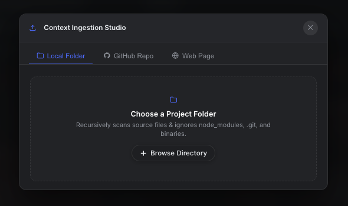
</p>

- **Local Directory Ingest**: Ingest full local multi-file codebases with interactive directory tree visualization and instant token estimation.
- **GitHub Repository Ingest**: Fetch public repositories directly from GitHub with branch switching, subfolder targeting, and file extension filtering.
- **Web Page Reader**: Extract clean, stripped text from documentation and technical articles directly into your active prompt buffer.

---

### 4. 🚀 Live Sandbox HTML/CSS/JS Preview & ZIP Scaffolder
<p align="center">
  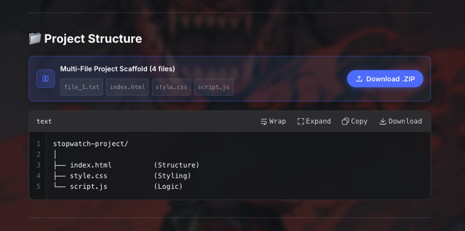
</p>
<p align="center">
  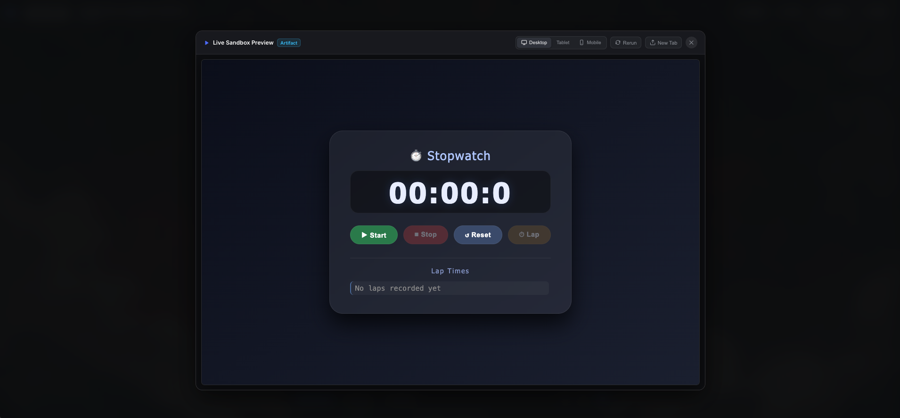
</p>
- **Interactive Live Sandbox**: Renders HTML/CSS/JS frontend code in an isolated iframe artifact with real-time responsive viewport toggling (**Desktop 100%**, **Tablet 768px**, **Mobile 375px**).
- **Zero Edge Bleeding**: Framed in obsidian dark aesthetic with zero white-edge artifacts.
- **1-Click ZIP Scaffolder**: Automatically detects multi-file code snippets (HTML, CSS, JS, Python, React) generated across the chat and bundles them into a downloadable `.zip` project.

---

### 5. 📊 Interactive Dynamic Markdown Tables
<p align="center">
  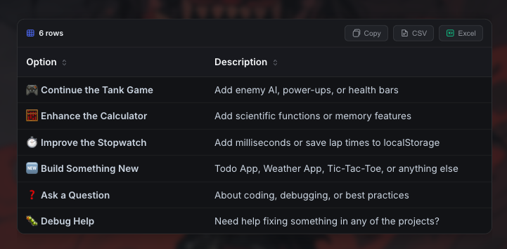
</p>

- **1-Click Export**: Copy any markdown table as clean CSV or download it directly as an Excel-compatible spreadsheet (`.xls`).
- **Interactive Sorting**: Click any column header to sort rows ascending or descending with visual sort indicator arrows.
- **Row Counters**: Live streaming badge indicating total row count in real-time.

---

### 6. 🖥️ Wide Chat Mode & Textarea Expander
<p align="center">
  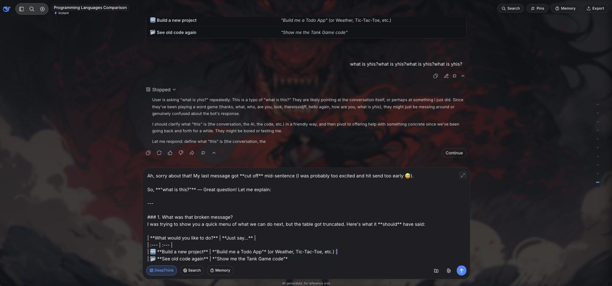
</p>

- **Widescreen Layout**: Expands chat messages and the prompt input box to a comfortable `1200px` layout with fluid `0.35s` transitions.
- **Prompt Expander**: Expand the textarea up to `60vh` for complex multi-line prompts while keeping bottom buttons permanently docked and accessible.
- **Scroll to Top of Message**: Jump directly to the top of lengthy responses using the dedicated scroll-to-top button on each message bar.

---

### 7. 💻 Developer Code Enhancements & Fullscreen Viewer
<p align="center">
  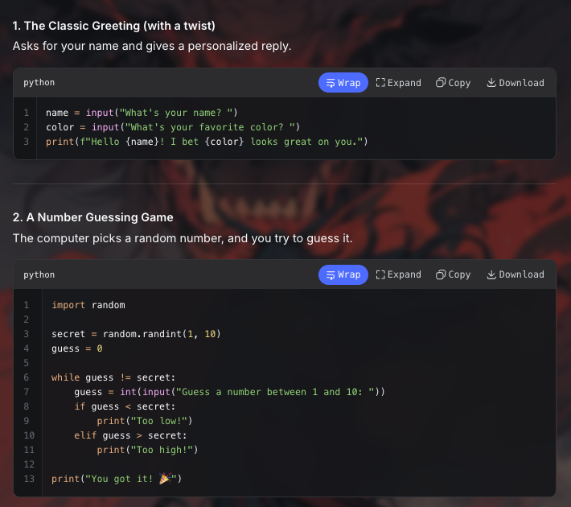
</p>

- **Unselectable Sticky Line Numbers**: Clean, synchronized line numbering on all code snippets.
- **Word Wrap Toggle**: Switch between horizontal code scrolling and wrapped view with one click.
- **Fullscreen Syntax Viewer**: Expand code into a focused, distraction-free modal with syntax highlighting and copy tools.

---

### 8. 🖼️ Custom Wallpaper Compositor
<p align="center">
  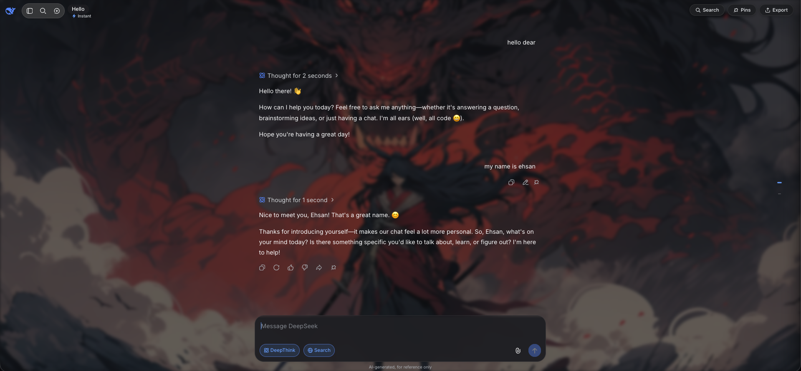
</p>

- **Hardware-Accelerated Compositing**: Custom wallpaper renders underneath all chat content with zero CPU overhead.
- **Real-Time Sliders**: Adjust background opacity (5%–60%) and Gaussian blur (0px–20px) directly in the extension dashboard.
- **Glassmorphic Chat UI**: Transparent message bubbles and action bars designed to blend seamlessly with your custom background.

---

### 9. 🔍 In-Chat Keyword Search & Message Pins
<p align="center">
  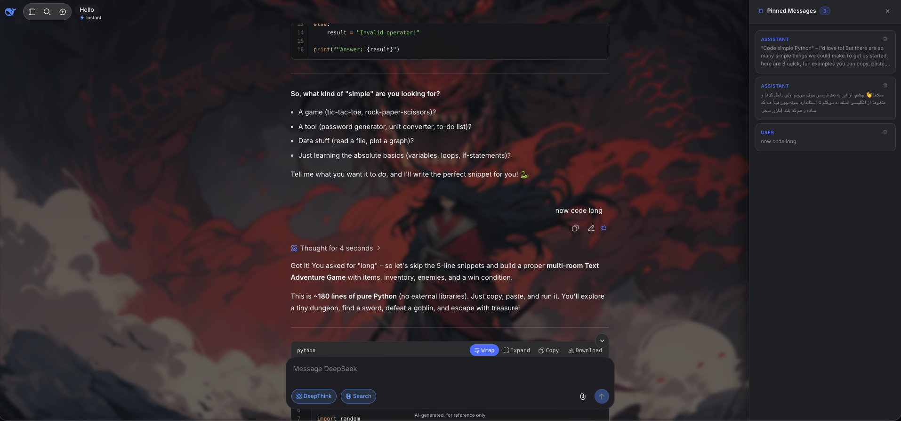
</p>

- **Integrated Search Bar**: Press <kbd>Ctrl + F</kbd> or click Search on the floating toolbar to locate words across long conversations.
- **Quick Match Navigation**: Use <kbd>Enter</kbd> / <kbd>Shift + Enter</kbd> to jump between matches with viewport auto-scrolling.
- **Pinned Messages Drawer**: Save vital assistant responses or prompts with native pushpin buttons and browse them in a slide-out drawer.

---

### 10. ✍️ Slash Commands & Prompt History
<p align="center">
  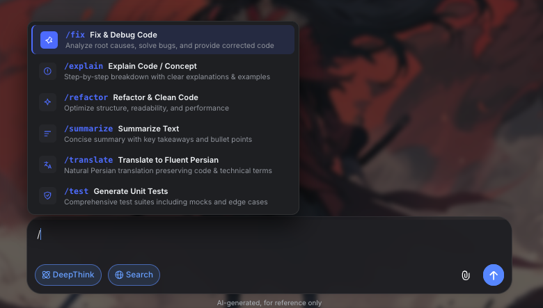
</p>

- **Instant Templates (`/`)**: Trigger structured coding, explanation, refactoring, and translation prompts in milliseconds.
- **History Cycling (<kbd>↑</kbd> / <kbd>↓</kbd>)**: Recall past prompts sequentially without re-typing.
- **Auto-Collapse R1 Thinking**: Keeps DeepSeek-R1 reasoning accordions neatly collapsed until you choose to expand them.

---

## 📂 Modular Project Structure

```
deepseek-orbit/
├── manifest.json              # Chrome Extension Manifest (V3)
├── src/
│   ├── core/
│   │   ├── constants.js       # SVG icon library, font maps, slash templates & default state
│   │   ├── detector.js        # Unicode bi-directional RTL detection algorithm
│   │   └── storage.js         # Settings persistence & chrome.storage.local sync
│   ├── ui/
│   │   ├── custom-instructions.js # Persona & Persistent Instructions Memory Studio
│   │   ├── context-importer.js    # Local folder, GitHub repository & web context ingestion
│   │   ├── dynamic-tables.js      # Dynamic table sorting, CSV export & Excel download
│   │   ├── zip-bundler.js         # Multi-file code project detector & ZIP scaffolder
│   │   ├── sandbox-preview.js     # Live iframe sandbox preview with responsive viewports
│   │   ├── textarea-expander.js   # Smooth prompt box expander & action bar docking
│   │   ├── code-enhancer.js       # Sticky line numbers, word wrap & fullscreen syntax modal
│   │   ├── search.js              # In-chat keyword search, match counter & auto-scroller
│   │   ├── pins.js                # Message bookmarking system & slide-out pinned drawer
│   │   ├── wallpaper.js           # Background wallpaper compositor & glassmorphism
│   │   ├── slash-commands.js      # Slash templates (/) & prompt history cycling (↑/↓)
│   │   └── toolbar.js             # Floating suite toolbar & multi-format export dropdown
│   ├── popup/
│   │   ├── popup.html             # Extension popup dashboard
│   │   ├── popup.css              # Glassmorphic dark theme styles
│   │   └── popup.js               # Real-time state persistence & cross-tab sync
│   ├── content.js                 # Content script runtime coordinator
│   └── content.css                # DeepSeek native design system styles & animations
├── icons/
│   ├── icon16.png                 # 16x16 HD Extension Icon
│   ├── icon48.png                 # 48x48 HD Extension Icon
│   └── icon128.png                # 128x128 HD Extension Icon
├── assets/
│   ├── banner.png                 # Official 16:9 glowing orbital hero banner
│   ├── icon.png                   # Official 3D glassmorphic logo
│   └── screenshots/               # Extension interface preview screenshots
├── docs/
│   └── ARCHITECTURE.md            # Technical architecture reference
├── CHANGELOG.md                   # Version release notes (v1.0.0 → v2.0.0)
├── CONTRIBUTING.md                # Open-source contribution guide
├── LICENSE                        # MIT License (Copyright 2026 Ehsan Shahbazi)
└── package.json                   # Development metadata & bundling scripts
```

---

## ⌨️ Keyboard Shortcuts

| Shortcut | Action | Description |
| :--- | :--- | :--- |
| <kbd>Ctrl</kbd> + <kbd>Shift</kbd> + <kbd>X</kbd> / <kbd>Cmd</kbd> + <kbd>Shift</kbd> + <kbd>X</kbd> | **Toggle Direction** | Instantly switches the prompt input box between RTL and LTR |
| <kbd>Ctrl</kbd> + <kbd>F</kbd> | **In-Chat Search** | Opens the keyword search bar with real-time match highlighting |
| <kbd>Enter</kbd> / <kbd>Shift</kbd> + <kbd>Enter</kbd> | **Next / Prev Match** | Jumps to the next or previous keyword match |
| <kbd>↑</kbd> / <kbd>↓</kbd> | **Prompt History** | Cycles through previously sent prompts in the input field |
| <kbd>/</kbd> | **Slash Templates** | Opens the instant prompt templates dropdown |
| <kbd>Esc</kbd> | **Close Overlays** | Closes search bar, fullscreen code modal, or pinned messages drawer |

---

## 🚀 Installation Guide

### Chrome / Brave / Edge / Chromium

1. Clone or download this repository:
   ```bash
   git clone https://github.com/EhsanShahbazii/DeepSeek-Orbit.git
   cd DeepSeek-Orbit
   ```
2. Open your browser and navigate to **`chrome://extensions/`**.
3. Enable **Developer mode** in the top-right corner.
4. Click **Load unpacked** in the top-left corner.
5. Select the `DeepSeek-Orbit` root directory.
6. Open **[chat.deepseek.com](https://chat.deepseek.com)** and enjoy a supercharged DeepSeek experience!

---

## 🛡️ Privacy & Security

> [!NOTE]
> **DeepSeek Orbit** is 100% client-side and open-source.
>
> - **Zero Analytics / Tracking**: No tracking pixels, remote telemetries, or data collection.
> - **Local Storage Only**: All settings, custom wallpapers, and pins stay strictly inside your browser's `chrome.storage.local`.
> - **No Remote Dependencies**: Loads zero external scripts at runtime.

---

## 👨‍💻 Author & Credits

- **Architect & Lead Developer**: **Ehsan Shahbazi**
- **GitHub**: [@EhsanShahbazii](https://github.com/EhsanShahbazii)
- **Email**: [ehsan.shahbazipc@gmail.com](mailto:ehsan.shahbazipc@gmail.com)

---

## 🤝 Contributing

Contributions are warmly welcomed! Please read [CONTRIBUTING.md](CONTRIBUTING.md) for details on our code of conduct and pull request process.

---

## 📄 License

This project is licensed under the **MIT License** — see the [LICENSE](LICENSE) file for details.

Copyright (c) 2026 **Ehsan Shahbazi**.
