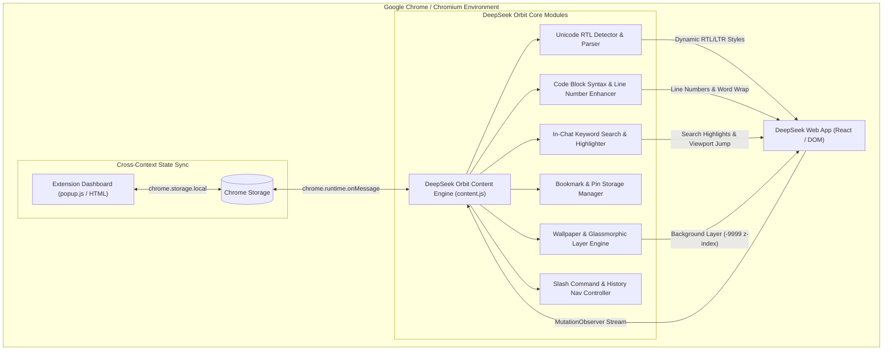

# DeepSeek Orbit — System Architecture 🏛️

DeepSeek Orbit is engineered with a high-performance, non-destructive architecture tailored specifically for **chat.deepseek.com**'s reactive DOM and virtualized rendering pipeline.

---

## 🏗️ Core Architecture Overview

---

## 📦 Key Subsystems

### 1. 🔄 Bi-Directional RTL Engine
- **Unicode Analysis**: Analyzes text nodes against standard RTL Unicode character blocks (`\u0600-\u06FF`, `\u0750-\u077F`, `\uFB50-\uFDFF`, `\uFE70-\uFEFF`).
- **Isolation Boundaries**: Automatically skips code elements (`pre`, `code`, `.md-code-block`) and LaTeX math containers (`.katex`, `.katex-display`) to guarantee strict LTR preservation.

### 2. 🖼️ Wallpaper & Glassmorphic Compositor
- **Layer Placement**: Injects a dedicated `#ds-custom-wallpaper-layer` prepended to `document.body` with `z-index: -9999` and `pointer-events: none`.
- **Selective Transparency**: Removes solid opaque masks (`.cb86951c`, `._7780f2e`, `._2bd7b35`, `d72636e2`) while leaving DeepSeek's native sidebar and menus intact.

### 3. 🔍 Virtualized In-Chat Search
- Scans chat text nodes dynamically, applies temporary highlight marks, counts occurrences, and scrolls target matches into view with smooth easing.

### 4. 📌 Stable Pinning System
- Calculates cryptographic/content hashes (`msg-hash`) to retain bookmarks persistently across browser sessions and chat reloads.
